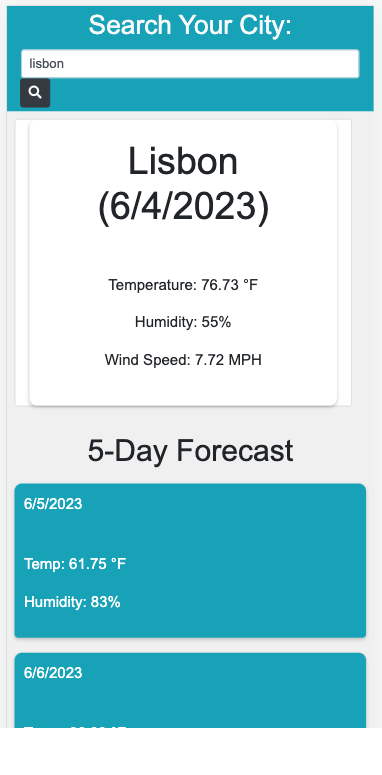

# Weather Dashboard 

## Description

The Weather Dashboard by Evince Edouard is a powerful application that provides users with real-time 5-day weather forecasts for their current city. It leverages the Open Weather API, ensuring the utmost accuracy in weather data for any location.

This application is built using a combination of HTML, CSS, Bootstrap, and JavaScript, resulting in a seamless and visually appealing user interface.

## Usage

The Weather Dashboard offers a user-friendly interface that allows users to effortlessly search for weather information in various cities around the world. By utilizing the search functionality in the "Aside" section, users can retrieve up-to-date weather details for their requested location.

This application is designed to be compatible with both desktop and mobile devices, allowing users to access weather information on the go.

## Screenshot

## Test

To experience the Weather Dashboard firsthand, visit the webpage using the following link: [https://eedouard28.github.io/weather-dashboard/](https://eedouard28.github.io/weather-dashboard/)